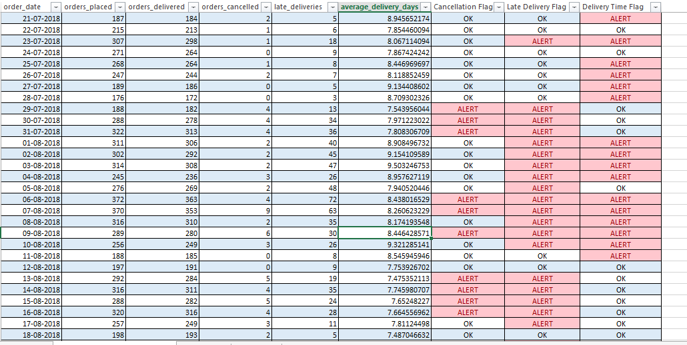
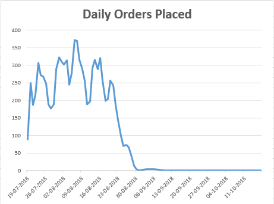
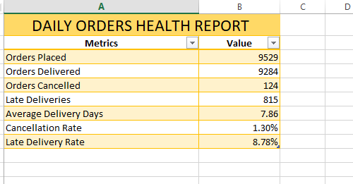

# Daily Orders Health Report

> **SQL Server + Microsoft Excel analysis of Olist e-commerce order volume, delivery performance, cancellations, and late-delivery risk.**

[](https://www.microsoft.com/sql-server)
[](https://www.microsoft.com/microsoft-365/excel)
[](https://www.kaggle.com/datasets/olistbr/brazilian-ecommerce)

## Overview

This project develops a practical daily health-monitoring report for the **Olist Brazilian E-Commerce Public Dataset**. The workflow combines SQL Server analysis with an Excel reporting layer to transform raw order-level data into operational KPIs, daily trends, alert flags, and business findings.

The report is designed to answer a core operations question:

> **Is order and delivery performance healthy, and which dates require investigation?**

The analysis focuses on the final 90-day period available in the order dataset: **July 19, 2018 through October 17, 2018**.

## Business Objectives

The report helps an operations or business-intelligence team monitor:

- Daily order volume
- Delivered and cancelled orders
- Late-delivery activity
- Average delivery time
- Cancellation and late-delivery rates
- Dates that exceed defined operational thresholds
- Potential delivery-timeliness risks requiring further review

## Dataset

This project uses the **Olist Brazilian E-Commerce Public Dataset**, which contains approximately 100,000 orders from a Brazilian e-commerce marketplace.

The source order data covers approximately **September 2016 through October 2018**. For focused operational monitoring, this project analyzes the final 90-day window represented in the SQL report.

### Primary source table

- `olist_orders_dataset`

### Important fields used

- `order_id`
- `order_status`
- `order_purchase_timestamp`
- `order_delivered_customer_date`
- `order_estimated_delivery_date`

## Technology Stack

- **SQL Server / T-SQL** — data profiling, KPI calculation, conditional aggregation, and daily reporting
- **SQL Server Management Studio (SSMS)** — query execution and validation
- **Microsoft Excel** — report presentation, monitoring flags, summaries, and findings
- **GitHub** — version control and portfolio documentation

## Repository Structure

```text
.
├── excel/
│   └── daily_orders_health_report.xlsx
├── screenshorts/
│   ├── daily_health_report.png
│   ├── daily_orders_chart.png
│   ├── findings .png
│   └── summary.png
├── sql/
│   └── olist_orders_health_report.sql
└── README.md
```

> The `screenshorts` directory name is retained to match the existing repository structure.

## Analysis Workflow

```text
Olist order data
       ↓
SQL Server data profiling
       ↓
Final 90-day analysis window
       ↓
Daily KPI aggregation
       ↓
Operational health flags
       ↓
Excel report and visual summaries
       ↓
Business findings
```

## SQL Analysis

The SQL script in [`sql/olist_orders_health_report.sql`](sql/olist_orders_health_report.sql) produces the core metrics used in the report.

### Analysis components

1. Total order count
2. Order-status distribution
3. Minimum and maximum order dates
4. Final 90-day analysis boundaries
5. Orders placed during the analysis period
6. Delivered orders
7. Cancelled orders
8. Late deliveries
9. Average delivery time
10. Daily orders placed
11. Daily orders delivered
12. Daily cancelled orders
13. Daily late deliveries
14. Daily average delivery time
15. Final daily orders health report

### SQL techniques demonstrated

- `COUNT`, `SUM`, and `AVG`
- `MIN` and `MAX`
- `WHERE` filtering
- `GROUP BY` and `ORDER BY`
- `CAST` for date-level aggregation
- `DATEADD` for date-window calculations
- `DATEDIFF` for delivery-duration analysis
- `CASE WHEN` conditional logic
- Conditional aggregation
- Null handling for delivery dates

## Key Performance Indicators

The report summarizes the following results for the analyzed period:

| KPI | Result |
|---|---:|
| Orders placed | 9,529 |
| Orders delivered | 9,284 |
| Orders cancelled | 124 |
| Late deliveries | 815 |
| Average delivery time | 7.86 days |
| Cancellation rate | 1.30% |
| Late-delivery rate | 8.78% |

### KPI definitions

- **Cancellation rate** = `Cancelled Orders / Orders Placed × 100`
- **Late-delivery rate** = `Late Deliveries / Delivered Orders × 100`
- **Average delivery time** = Average number of days between purchase and customer delivery for delivered orders
- **Late delivery** = Delivered after the estimated delivery date

## Excel Report

The workbook [`excel/daily_orders_health_report.xlsx`](excel/daily_orders_health_report.xlsx) contains three principal reporting areas:

### 1. Daily Health Report

A daily operational dataset containing:

- Orders placed
- Orders delivered
- Orders cancelled
- Late deliveries
- Average delivery days

### 2. Operational Health Flags

The report uses exercise-specific thresholds to highlight dates that may require investigation:

| Metric | Alert threshold |
|---|---:|
| Cancelled orders | `> 3` |
| Late deliveries | `> 10` |
| Average delivery days | `> 8` |

These thresholds are intended as a transparent monitoring framework for this project. In a production environment, they should be calibrated using historical baselines, service-level agreements, seasonality, and business-owner input.

### 3. Summary and Findings

The summary section presents the overall KPIs, while the findings section translates the numerical results into operational observations and possible areas for follow-up.

## Key Findings

- The analysis covers **9,529 orders** placed during the selected 90-day period.
- **9,284 orders** were delivered, while **124 orders** were cancelled.
- **815 deliveries** were classified as late, resulting in an **8.78% late-delivery rate** among delivered orders.
- The **1.30% cancellation rate** is lower than the late-delivery rate, indicating that delivery timeliness is the more prominent operational concern in this analysis.
- Daily threshold flags provide a simple method for identifying dates that may need additional investigation.

## Report Previews

### Daily health report



### Daily orders trend



### Summary dashboard



### Findings


## How to Reproduce the Analysis

1. Obtain the Olist Brazilian E-Commerce Public Dataset.
2. Load the relevant order data into a SQL Server database.
3. Create or select a database named `OlistAnalytics`, or update the `USE` statement in the SQL script.
4. Confirm that the table `olist_orders_dataset` exists and that the required date and status columns are available.
5. Open [`sql/olist_orders_health_report.sql`](sql/olist_orders_health_report.sql) in SQL Server Management Studio.
6. Review the analysis dates if applying the workflow to a different reporting period.
7. Execute the queries and export the daily health result for Excel reporting.
8. Review the workbook, KPI summary, charts, and operational health flags.

## Data Quality and Interpretation Notes

- The SQL script currently uses a fixed reporting window from **July 19, 2018 at 17:30:18** through **October 17, 2018 at 17:30:18**. Update these boundaries when refreshing the analysis.
- Delivery metrics are calculated only where the required delivery timestamps are available.
- A late delivery is identified when `order_delivered_customer_date` is later than `order_estimated_delivery_date`.
- Orders are grouped by purchase date for the main daily cohort report.
- The alert thresholds are analytical assumptions rather than official Olist service-level targets.
- The reported results should be validated if the source data is transformed, deduplicated, or loaded into a different schema.

## Potential Enhancements

Future iterations could extend the report with:

- Dynamic date parameters instead of hard-coded date boundaries
- Automated SQL-to-Excel refresh workflows
- Regional and state-level delivery analysis
- Seller, product-category, and freight-performance analysis
- Week-over-week and month-over-month comparisons
- Rolling averages and seasonality-adjusted thresholds
- Automated email or dashboard alerts
- Data validation checks for duplicate orders and missing timestamps
- Power BI publication for interactive stakeholder reporting

## Project Purpose

This repository demonstrates an end-to-end analytics workflow: translating business questions into SQL logic, producing operational KPIs, building a repeatable monitoring report, and communicating findings in a business-friendly format.

## License and Data Attribution

This repository is an analytical portfolio project. The Olist dataset is publicly available through the [Olist Brazilian E-Commerce Public Dataset](https://www.kaggle.com/datasets/olistbr/brazilian-ecommerce). Please review the dataset provider's terms and attribution requirements before redistributing the source data.
