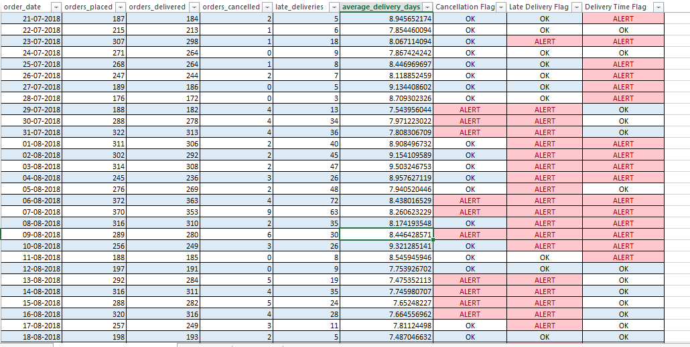
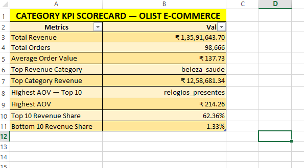
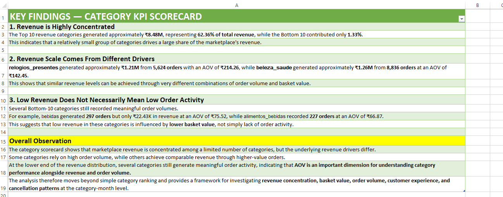

# Daily Orders Health Report

<p align="center">
  <strong>SQL Server and Excel Business Intelligence Project for E-Commerce Performance Monitoring</strong>
</p>

<p align="center">
  Transforming Olist marketplace data into operational health metrics, delivery insights, cancellation monitoring, and category-level performance intelligence.
</p>

<p align="center">
  <a href="https://github.com/Himanshi-Bhere/daily-orders-health-report">
    
  </a>
  <a href="https://www.microsoft.com/sql-server">
    
  </a>
  <a href="https://www.microsoft.com/microsoft-365/excel">
    
  </a>
  <a href="https://www.kaggle.com/datasets/olistbr/brazilian-ecommerce">
    
  </a>
</p>

---

## Executive Summary

The **Daily Orders Health Report** is an end-to-end business analytics project developed using **Microsoft SQL Server, T-SQL, and Microsoft Excel**.

The project analyzes the Olist Brazilian E-Commerce dataset to monitor operational performance, identify delivery risks, evaluate cancellations, and compare product-category performance.

This repository contains two connected analytical workstreams:

1. **Part 1 — Daily Order Health**
2. **Part 2 — Category KPI Scorecard**

Together, these workstreams demonstrate how raw transactional data can be converted into structured KPIs, operational monitoring reports, category scorecards, and actionable business insights.

---

## Business Problem

E-commerce businesses need to monitor both operational execution and commercial performance.

This project addresses questions such as:

- How many orders were placed during the selected reporting period?
- How many orders were delivered successfully?
- How many orders were cancelled?
- How many deliveries occurred after the estimated delivery date?
- What was the average delivery time?
- Which product categories generated the most revenue?
- Which categories had the highest order volume?
- Which categories had stronger customer review scores?
- Which categories showed higher cancellation risk?
- Which categories should be prioritized for improvement?

---

## Project Objectives

The main objectives of this project are to:

- Build a repeatable SQL-based analytics workflow
- Monitor daily order and delivery performance
- Measure delivery delays and cancellation activity
- Calculate operational health indicators
- Analyze revenue by product category
- Calculate category-level average order value
- Evaluate customer review performance
- Measure category-level cancellation rates
- Classify categories using revenue bands
- Identify top-performing and underperforming categories
- Present business findings through Excel-based reporting

---

## Project Architecture

```text
Olist E-Commerce Dataset
            |
            v
SQL Server Data Loading
            |
            v
Data Validation and Table Checks
            |
            v
Relational Joins and Data Preparation
            |
            v
KPI Calculations and Business Rules
            |
            +-----------------------------+
            |                             |
            v                             v
Part 1: Daily Order Health       Part 2: Category KPI Scorecard
            |                             |
            v                             v
Operational Monitoring            Commercial Performance Analysis
            |                             |
            +-------------+---------------+
                          |
                          v
                 Excel Reporting
                          |
                          v
             Business Findings and Insights
```

---

# Part 1 — Daily Order Health

## Purpose

Part 1 focuses on operational performance during a selected 90-day reporting period.

The analysis evaluates order volume, delivery completion, cancellations, late deliveries, and average delivery duration.

## Reporting Period

```text
July 19, 2018 through October 17, 2018
```

## Business Questions

Part 1 answers the following questions:

- How many orders were placed during the reporting period?
- How many orders were delivered?
- How many orders were cancelled?
- How many delivered orders were late?
- What was the average delivery time?
- How did order volume change by date?
- Which dates showed unusual operational activity?
- Was delivery delay or cancellation the more significant operational concern?

## Part 1 Metrics

The daily health analysis calculates:

- Total orders
- Orders placed by day
- Delivered orders
- Cancelled orders
- Late deliveries
- Average delivery days
- Daily delivery activity
- Daily cancellation activity
- Daily late-delivery activity
- Daily average delivery time

## Part 1 KPI Snapshot

| KPI | Result |
|---|---:|
| Orders placed | **9,529** |
| Orders delivered | **9,284** |
| Orders cancelled | **124** |
| Late deliveries | **815** |
| Average delivery time | **7.86 days** |
| Cancellation rate | **1.30%** |
| Late-delivery rate | **8.78%** |

## Part 1 Business Interpretation

The analysis indicates that delivery timeliness was a more significant operational concern than cancellations during the selected reporting period.

The cancellation rate was relatively low compared with the late-delivery rate. Therefore, the most important improvement areas would include:

- Delivery reliability
- Logistics coordination
- Carrier performance
- Estimated delivery-date accuracy
- Seller fulfillment performance
- Early identification of high-risk delivery dates

## Part 1 SQL Logic

The SQL analysis includes:

- Total order counting
- Order-status distribution
- Minimum and maximum order dates
- Rolling 90-day period identification
- Delivered-order filtering
- Cancelled-order filtering
- Late-delivery identification
- Average delivery-time calculation
- Daily order aggregation
- Daily delivery aggregation
- Daily cancellation aggregation
- Daily late-delivery aggregation
- Final daily order health report

## Part 1 Files

- [Open Part 1 SQL Script](part1-order-health/sql/part1_daily_orders_health.sql)
- [View Daily Health Report](part1-order-health/screenshorts/daily_health_report.png)
- [View Daily Orders Trend](part1-order-health/screenshorts/daily_orders_chart.png)
- [View Operational Summary](part1-order-health/screenshorts/summary.png)
- [View Operational Findings](part1-order-health/screenshorts/findings%20.png)

---

# Part 2 — Category KPI Scorecard

## Purpose

Part 2 evaluates the commercial and customer-experience performance of product categories.

The analysis combines revenue, order volume, average order value, customer review scores, cancellation activity, and revenue classification.

## Business Questions

Part 2 answers the following questions:

- Which product categories generate the highest revenue?
- Which categories have the highest order volume?
- What is the average order value for each category?
- Which categories receive the strongest customer review scores?
- Which categories have the highest cancellation rates?
- How does category performance change by month?
- Which categories belong to the top-performing group?
- Which categories require additional attention?

## Part 2 Metrics

The category scorecard calculates:

- Total revenue
- Total unique orders
- Average order value
- Average review score
- Cancelled orders
- Cancellation rate
- Monthly category revenue
- Monthly category order volume
- Monthly category review score
- Revenue-band classification
- Top-10 category ranking
- Bottom-10 category ranking

## Revenue-Band Classification

Categories are classified using the following analytical rules:

| Revenue Threshold | Classification |
|---:|---|
| Revenue greater than or equal to 1,000,000 | **Star** |
| Revenue greater than or equal to 700,000 | **Watch** |
| Revenue below 700,000 | **Fix** |

These classifications are analytical categories created specifically for this project.

## Ranking Methodology

The top and bottom category rankings are calculated only for categories with at least **100 distinct orders**.

This minimum-volume condition helps avoid ranking categories with very limited activity.

The ranking output includes:

- Ranking type
- Category rank
- Product category
- Total revenue
- Total orders
- Average order value

## Part 2 SQL Logic

The SQL analysis includes:

- Table and column validation
- Order, item, and product joins
- Revenue calculation
- Revenue by category
- Revenue by month and category
- Total unique-order calculation
- Orders by category
- Monthly category order volume
- Revenue-band classification
- Monthly category average order value
- Average customer review score
- Monthly category review score
- Total cancellation calculation
- Overall cancellation rate
- Monthly category cancellation rate
- Final monthly category KPI scorecard
- Top-10 and bottom-10 category ranking

## Part 2 Files

- [Open Part 2 SQL Script](part2-category-pkpi-scorecard/sql/part2_category_kpi_scorecard.sql)
- [View Category KPI Scorecard](part2-category-pkpi-scorecard/screenshorts/part2_category_pivot.png)
- [View Category Summary](part2-category-pkpi-scorecard/screenshorts/part2_summary.png)
- [View Category Findings](part2-category-pkpi-scorecard/screenshorts/part2_findings.png)
- [View Category Performance Sparklines](part2-category-pkpi-scorecard/screenshorts/part2_sparkline.png)

---

## Combined KPI Framework

### Operational Health KPIs

| KPI | Business Meaning |
|---|---|
| Total orders | Measures total demand |
| Orders placed by day | Shows daily workload and demand movement |
| Delivered orders | Measures successful order completion |
| Cancelled orders | Highlights fulfillment or customer-retention risk |
| Late deliveries | Measures delivery reliability |
| Average delivery days | Measures fulfillment speed |
| Cancellation rate | Normalizes cancellation performance |
| Late-delivery rate | Measures service-level risk |

### Category Performance KPIs

| KPI | Business Meaning |
|---|---|
| Total revenue | Measures commercial contribution |
| Total unique orders | Measures category demand |
| Average order value | Measures average customer spend |
| Average review score | Measures customer satisfaction |
| Cancelled orders | Measures category-level fulfillment risk |
| Cancellation rate | Enables comparison across categories |
| Revenue band | Classifies category commercial importance |
| Category ranking | Supports prioritization and benchmarking |

---

## Data Model

The project uses the following primary Olist tables:

```text
olist_orders_dataset
olist_order_items_dataset
olist_products_dataset
olist_order_reviews_dataset
```

### Key relationships

```text
olist_orders_dataset
        |
        +── olist_order_items_dataset
                    |
                    +── olist_products_dataset

olist_orders_dataset
        |
        +── olist_order_reviews_dataset
```

### Important fields

```text
order_id
order_status
order_purchase_timestamp
order_delivered_customer_date
order_estimated_delivery_date
product_id
product_category_name
price
review_score
```

---

## Technology Stack

| Technology | Purpose |
|---|---|
| **Microsoft SQL Server** | Data storage, querying, preparation, and validation |
| **T-SQL** | KPI calculations, joins, aggregations, rankings, and classifications |
| **SQL Server Management Studio** | SQL script execution and result validation |
| **Microsoft Excel** | Reporting, dashboards, visual analysis, and findings |
| **GitHub** | Version control, documentation, and portfolio presentation |

---

## SQL Techniques Demonstrated

This project demonstrates practical SQL Server techniques, including:

- `INNER JOIN`
- `LEFT JOIN`
- `GROUP BY`
- `ORDER BY`
- `COUNT`
- `COUNT(DISTINCT)`
- `SUM`
- `AVG`
- `MIN`
- `MAX`
- `CASE WHEN`
- Conditional aggregation
- Common table expressions
- `DATEADD`
- `DATEDIFF`
- `CAST`
- `DATENAME`
- `YEAR`
- `MONTH`
- `NULLIF`
- `ROW_NUMBER`
- `HAVING`
- Null handling
- Date-level aggregation
- Monthly aggregation
- KPI classification
- Ranking logic
- Rate calculations
- Business-rule implementation

---

## Repository Structure

```text
.
├── excel/
│
├── part1-order-health/
│   ├── sql/
│   │   └── part1_daily_orders_health.sql
│   └── screenshorts/
│       ├── daily_health_report.png
│       ├── daily_orders_chart.png
│       ├── findings .png
│       └── summary.png
│
├── part2-category-pkpi-scorecard/
│   ├── sql/
│   │   └── part2_category_kpi_scorecard.sql
│   └── screenshorts/
│       ├── part2_category_pivot.png
│       ├── part2_findings.png
│       ├── part2_sparkline.png
│       └── part2_summary.png
│
└── README.md
```

---

## Report Previews

### Part 1 — Daily Order Health

#### Daily Health Report



#### Daily Orders Trend


#### Operational Summary


#### Operational Findings


---

### Part 2 — Category KPI Scorecard

#### Category KPI Scorecard


#### Category Summary



#### Category Findings



#### Category Performance Sparklines


---

## How to Reproduce the Analysis

### Prerequisites

Before running the analysis, install or have access to:

- Microsoft SQL Server
- SQL Server Management Studio
- Microsoft Excel
- Olist Brazilian E-Commerce Public Dataset

### Step 1 — Download the Dataset

Download the Olist Brazilian E-Commerce Public Dataset from Kaggle:

[Download the Olist Dataset](https://www.kaggle.com/datasets/olistbr/brazilian-ecommerce)

### Step 2 — Create the Database

Create a SQL Server database named:

```sql
CREATE DATABASE OlistAnalytics;
```

### Step 3 — Load the Required Tables

Load the following tables into the `OlistAnalytics` database:

```text
olist_orders_dataset
olist_order_items_dataset
olist_products_dataset
olist_order_reviews_dataset
```

### Step 4 — Validate the Data

Confirm that the tables contain the required columns:

```text
order_id
order_status
order_purchase_timestamp
order_delivered_customer_date
order_estimated_delivery_date
product_id
product_category_name
price
review_score
```

### Step 5 — Run Part 1

Open and execute:

```text
part1-order-health/sql/part1_daily_orders_health.sql
```

Review the operational outputs, including:

- Total orders
- Order statuses
- Daily order volume
- Delivered orders
- Cancelled orders
- Late deliveries
- Average delivery days
- Final daily health report

### Step 6 — Run Part 2

Open and execute:

```text
part2-category-pkpi-scorecard/sql/part2_category_kpi_scorecard.sql
```

Review the category outputs, including:

- Revenue by category
- Monthly category revenue
- Category order volume
- Average order value
- Review scores
- Cancellation rates
- Revenue bands
- Final KPI scorecard
- Top-10 and bottom-10 rankings

### Step 7 — Review the Reports

Use the available Excel reporting files and visual outputs to interpret the results and communicate the findings.

---

## Data Quality and Interpretation Notes

- Part 1 uses a fixed 90-day reporting period from **July 19, 2018 through October 17, 2018**.
- The reporting dates can be modified when applying the analysis to another reporting period.
- Late delivery is identified when the actual customer delivery date is later than the estimated delivery date.
- Delivery-time calculations depend on the availability of actual delivery timestamps.
- Daily order metrics are grouped using the order purchase date.
- Daily delivered and late-delivery metrics are grouped using the customer delivery date.
- Revenue is calculated using order-item prices.
- Average order value is calculated as total revenue divided by distinct orders.
- Review scores are aggregated at the order level before category-level review analysis.
- Cancellation rate is calculated using distinct orders.
- Revenue-band thresholds are analytical classifications created for this project.
- Top-10 and bottom-10 category rankings require a minimum of 100 distinct orders.
- Results may change if the source data is cleaned, deduplicated, transformed, or loaded into a different database schema.
- The dataset is historical and should be treated as an analytical case study rather than a live operational system.

---

## Key Business Takeaways

### Operational perspective

The operational analysis shows that delivery timeliness requires closer attention than cancellation volume during the selected reporting period.

The late-delivery rate of **8.78%** is considerably higher than the cancellation rate of **1.30%**, suggesting that logistics and fulfillment reliability are key areas for improvement.

### Commercial perspective

The category scorecard enables decision-makers to distinguish between categories based on:

- Revenue contribution
- Customer demand
- Average customer spend
- Customer satisfaction
- Cancellation risk
- Monthly performance

This provides a more complete view than evaluating categories using revenue alone.

### Management perspective

The combined solution supports:

- Operational monitoring
- Category prioritization
- Risk identification
- Performance benchmarking
- Business review discussions
- Future dashboard automation

---

## Recommended Business Actions

Based on the analysis, the following actions could be considered:

### 1. Improve delivery reliability

Investigate the root causes of late deliveries, including:

- Seller fulfillment delays
- Carrier capacity constraints
- Logistics disruptions
- Regional delivery issues
- Inaccurate estimated delivery dates

### 2. Monitor high-risk dates

Create an alert process for dates with:

- Unusually high late deliveries
- Sudden order-volume changes
- Abnormal cancellation activity
- Increased average delivery duration

### 3. Prioritize category performance reviews

Use the category scorecard to identify:

- High-revenue categories with weak customer reviews
- High-volume categories with high cancellation rates
- Low-revenue categories requiring improvement
- Categories with strong growth potential

### 4. Improve performance thresholds

Calibrate revenue bands and operational thresholds using:

- Historical performance
- Business targets
- Service-level agreements
- Category-specific expectations

### 5. Automate recurring reporting

The project can be extended into an automated reporting solution with:

- Scheduled SQL execution
- Automated Excel refreshes
- Power BI dashboards
- Email notifications
- Exception-based alerts

---

## Potential Future Enhancements

Future improvements could include:

- Dynamic date parameters
- Automated SQL-to-Excel refresh workflows
- Power BI dashboard publication
- Regional and state-level analysis
- Seller-level performance analysis
- Product-level performance analysis
- Freight-cost analysis
- Shipping-time analysis
- Week-over-week comparison
- Month-over-month comparison
- Rolling averages
- Seasonality-adjusted thresholds
- Automated email alerts
- Duplicate-order detection
- Missing-date monitoring
- Data-quality validation checks
- Incremental reporting workflows
- Forecasting
- Anomaly detection
- Customer-segmentation analysis
- Profitability analysis

---

## Professional Skills Demonstrated

This project demonstrates the ability to:

- Translate business questions into analytical requirements
- Work with relational e-commerce data
- Validate data structures before analysis
- Join multiple source tables
- Build reusable KPI calculations
- Analyze operational performance
- Compare actual and estimated delivery dates
- Calculate revenue and category metrics
- Measure customer review performance
- Analyze cancellation risk
- Use SQL CTEs and window functions
- Build ranking and classification logic
- Create Excel-based reporting outputs
- Present data-driven findings clearly
- Connect technical analysis to business decisions
- Structure an analytics project professionally on GitHub

---

## Dataset Attribution

This project uses the **Olist Brazilian E-Commerce Public Dataset**.

The dataset contains information related to approximately 100,000 orders from a Brazilian online marketplace, including:

- Orders
- Order status
- Order items
- Products
- Product categories
- Customer reviews
- Product prices
- Delivery dates
- Estimated delivery dates

Dataset source:

[Olist Brazilian E-Commerce Public Dataset](https://www.kaggle.com/datasets/olistbr/brazilian-ecommerce)

---

## Author

### Himanshi Bhere

This project is part of an analytics portfolio focused on:

- SQL Server
- T-SQL
- Business intelligence
- E-commerce analytics
- Operational performance monitoring
- Excel reporting
- KPI development
- Data-driven decision support

---

## License and Attribution

This repository is an analytical portfolio project created for educational, professional development, and business intelligence demonstration purposes.

The underlying data is provided by the **Olist Brazilian E-Commerce Public Dataset** and is available through Kaggle.
