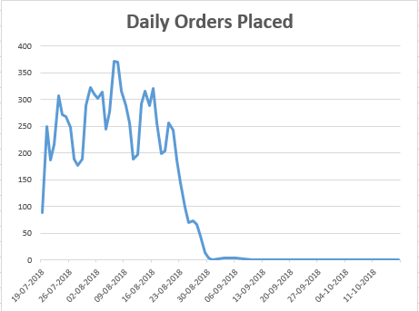
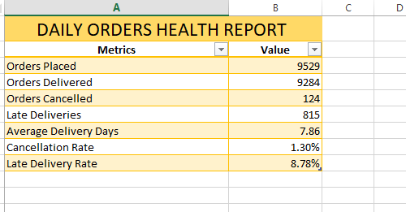
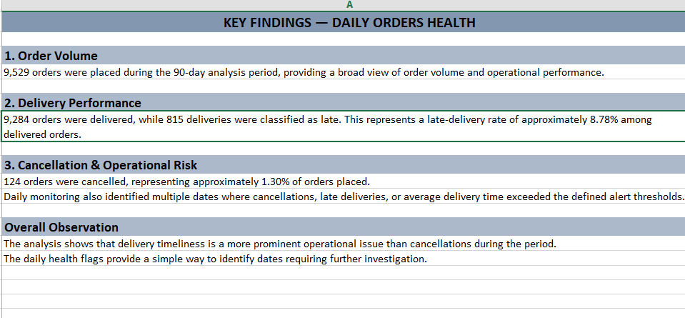
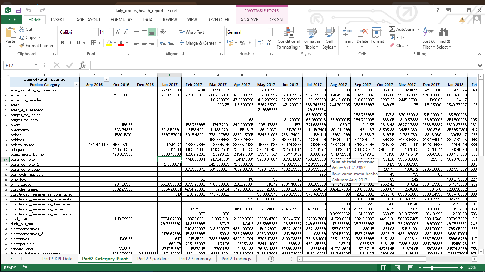
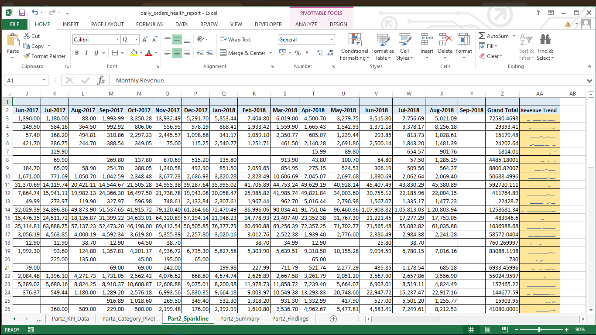

# Daily Orders Health Report

> **SQL Server and Microsoft Excel analytics project for monitoring e-commerce order health, delivery performance, cancellations, late deliveries, and category-level business KPIs.**

[](https://www.microsoft.com/sql-server)
[](https://www.microsoft.com/microsoft-365/excel)
[](https://www.kaggle.com/datasets/olistbr/brazilian-ecommerce)
[](https://github.com/Himanshi-Bhere/daily-orders-health-report)

---

## Overview

The **Daily Orders Health Report** is an end-to-end business analytics project based on the Olist Brazilian E-Commerce Public Dataset.

The project combines **SQL Server**, **T-SQL**, and **Microsoft Excel** to transform raw e-commerce data into practical operational and commercial insights.

It answers two key business questions:

1. **Is daily order and delivery performance healthy?**
2. **Which product categories require attention based on revenue, order volume, average order value, customer reviews, and cancellation rate?**

The project is organized into two analytical workstreams:

- [Part 1 — Daily Order Health](part1-order-health/README.md)
- [Part 2 — Category KPI Scorecard](part2-category-kpi-scorecard/README.md)

---

## Business Objectives

This project is designed to help operations and business intelligence teams monitor:

- Daily order volume
- Delivered and cancelled orders
- Late-delivery activity
- Average delivery duration
- Cancellation rate
- Late-delivery rate
- Revenue by product category
- Monthly category performance
- Average order value
- Customer review performance
- Category-level cancellation risk
- Top- and bottom-performing categories
- Dates and categories requiring investigation

---

## Repository Structure

```text
.
├── part1-order-health/
│   ├── excel/
│   │   └── daily_orders_health_report.xlsx
│   ├── sql/
│   │   └── part1_daily_orders_health.sql
│   ├── screenshots/
│   │   ├── daily_health_report.png
│   │   ├── daily_orders_chart.png
│   │   ├── findings.png
│   │   └── summary.png
│   └── README.md
│
├── part2-category-kpi-scorecard/
│   ├── excel/
│   │   └── .gitkeep
│   ├── sql/
│   │   └── part2_category_kpi_scorecard.sql
│   ├── screenshots/
│   │   ├── part2_category_pivot.png
│   │   ├── part2_findings.png
│   │   ├── part2_sparkline.png
│   │   └── part2_summary.png
│   └── README.md
│
└── README.md
```

> The Part 2 Excel folder is reserved for the category scorecard workbook.

---

## Analytical Workstreams

### Part 1 — Daily Order Health

Part 1 focuses on operational performance during a selected 90-day reporting period.

The analysis includes:

- Orders placed
- Orders delivered
- Orders cancelled
- Late deliveries
- Average delivery time
- Daily operational health
- Threshold-based monitoring flags

The reporting period analyzed is:

```text
July 19, 2018 through October 17, 2018
```

View the complete analysis:

[Open Part 1 documentation](part1-order-health/README.md)

[View Part 1 SQL script](part1-order-health/sql/part1_daily_orders_health.sql)

---

### Part 2 — Category KPI Scorecard

Part 2 evaluates commercial performance and customer experience by product category and month.

The analysis combines:

- Revenue
- Unique orders
- Average order value
- Average review score
- Cancelled orders
- Cancellation rate
- Revenue-band classification
- Top-10 category ranking
- Bottom-10 category ranking
- Monthly category performance

View the complete analysis:

[Open Part 2 documentation](part2-category-kpi-scorecard/README.md)

[View Part 2 SQL script](part2-category-kpi-scorecard/sql/part2_category_kpi_scorecard.sql)

---

## Technology Stack

| Technology | Purpose |
|---|---|
| **SQL Server / T-SQL** | Data preparation, joins, KPI calculations, aggregations, classifications, and rankings |
| **SQL Server Management Studio** | Query execution and validation |
| **Microsoft Excel** | Reporting, dashboards, charts, scorecards, and business findings |
| **GitHub** | Version control, documentation, and project presentation |

---

## Dataset

This project uses the **Olist Brazilian E-Commerce Public Dataset**, a public dataset containing approximately 100,000 orders from a Brazilian online marketplace.

The dataset provides information about:

- Orders
- Order status
- Order items
- Products
- Product categories
- Customer reviews
- Product prices
- Delivery dates
- Estimated delivery dates

### Primary Tables

```text
olist_orders_dataset
olist_order_items_dataset
olist_products_dataset
olist_order_reviews_dataset
```

### Key Fields

```text
order_id
order_status
order_purchase_timestamp
order_delivered_customer_date
order_estimated_delivery_date
product_id
product_category_name
price
review_score
```

Dataset source:

[Olist Brazilian E-Commerce Public Dataset](https://www.kaggle.com/datasets/olistbr/brazilian-ecommerce)

---

## Analysis Workflow

```text
Olist e-commerce dataset
          ↓
SQL Server data validation
          ↓
Table joins and data preparation
          ↓
KPI calculation
          ↓
Daily operational monitoring
          ↓
Category performance scorecard
          ↓
Excel reporting and visualization
          ↓
Business findings and recommendations
```

---

## Key Metrics

### Operational Health Metrics

- Total orders
- Orders placed by day
- Orders delivered
- Cancelled orders
- Late deliveries
- Average delivery days
- Cancellation rate
- Late-delivery rate

### Category Performance Metrics

- Total revenue
- Total unique orders
- Average order value
- Average customer review score
- Cancelled orders
- Cancellation rate
- Revenue band
- Category ranking

---

## SQL Techniques Demonstrated

The project demonstrates practical SQL Server techniques, including:

- `INNER JOIN`
- `LEFT JOIN`
- `GROUP BY`
- `ORDER BY`
- `COUNT`
- `COUNT(DISTINCT)`
- `SUM`
- `AVG`
- `MIN`
- `MAX`
- `CASE WHEN`
- Conditional aggregation
- Common table expressions
- `DATEADD`
- `DATEDIFF`
- `CAST`
- `DATENAME`
- `YEAR`
- `MONTH`
- `NULLIF`
- `ROW_NUMBER`
- `HAVING`
- Null handling
- Date-level aggregation

---

## Part 1 KPI Summary

The selected 90-day operational analysis produced the following results:

| KPI | Result |
|---|---:|
| Orders placed | 9,529 |
| Orders delivered | 9,284 |
| Orders cancelled | 124 |
| Late deliveries | 815 |
| Average delivery time | 7.86 days |
| Cancellation rate | 1.30% |
| Late-delivery rate | 8.78% |

These results indicate that delivery timeliness was a more significant operational concern than cancellations during the analyzed period.

---

## Report Previews

### Daily Health Report


### Daily Orders Trend



### Operational Summary



### Operational Findings



### Category KPI Scorecard



### Category Summary


### Category Findings


### Category Sparklines



---

## How to Reproduce the Analysis

### Prerequisites

- Microsoft SQL Server
- SQL Server Management Studio
- Microsoft Excel
- Olist Brazilian E-Commerce Public Dataset

### Database Setup

1. Download the Olist dataset.
2. Create a SQL Server database named:

```sql
OlistAnalytics
```

3. Load the required Olist tables into the database.
4. Confirm that the following tables exist:

```text
olist_orders_dataset
olist_order_items_dataset
olist_products_dataset
olist_order_reviews_dataset
```

5. Open the relevant SQL script in SQL Server Management Studio.
6. Execute the queries and review the output.
7. Export or transfer the results into Excel for reporting and visualization.

### Part 1 SQL Script

```text
part1-order-health/sql/part1_daily_orders_health.sql
```

### Part 1 Excel Workbook

```text
part1-order-health/excel/daily_orders_health_report.xlsx
```

### Part 2 SQL Script

```text
part2-category-kpi-scorecard/sql/part2_category_kpi_scorecard.sql
```

---

## Data Quality and Interpretation Notes

- Part 1 uses a fixed 90-day reporting window from July 19, 2018 through October 17, 2018.
- The reporting dates should be updated when applying the analysis to a new reporting period.
- Delivery metrics depend on the availability of delivery timestamps.
- A delivery is classified as late when the actual delivery date is later than the estimated delivery date.
- Daily operational metrics are grouped by order purchase date unless otherwise specified.
- Category revenue is calculated using order-item prices.
- Average order value is calculated as total revenue divided by distinct orders.
- Review scores are aggregated before category-level analysis.
- Revenue-band thresholds are analytical classifications created for this project.
- Operational thresholds should be calibrated against historical performance or formal service-level agreements.
- Results may change if the source data is cleaned, deduplicated, transformed, or loaded into a different schema.

---

## Potential Enhancements

Future improvements may include:

- Dynamic date parameters
- Automated SQL-to-Excel refresh workflows
- Power BI dashboard publication
- Regional and state-level analysis
- Seller and product-level performance analysis
- Freight-cost and shipping-time analysis
- Week-over-week and month-over-month comparisons
- Rolling averages
- Seasonality-adjusted alert thresholds
- Automated email notifications
- Duplicate-order detection
- Missing-date monitoring
- Data-quality validation checks
- Incremental reporting workflows

---

## Project Purpose

This repository demonstrates how raw e-commerce data can be transformed into actionable business intelligence.

It highlights the ability to:

- Translate business questions into SQL logic
- Build repeatable KPI calculations
- Monitor operational performance
- Combine multiple relational data sources
- Create category-level performance scorecards
- Identify business risks and opportunities
- Communicate analytical findings through Excel reports
- Document a complete analytics workflow

---

## Author

**Himanshi Bhere**

This repository is part of an analytics portfolio focused on SQL Server, Excel reporting, operational performance monitoring, and business intelligence.

---

## License and Attribution

This repository is an analytical portfolio project.

The underlying data is provided by the **Olist Brazilian E-Commerce Public Dataset** and is available through Kaggle:

[Olist Brazilian E-Commerce Public Dataset](https://www.kaggle.com/datasets/olistbr/brazilian-ecommerce)
